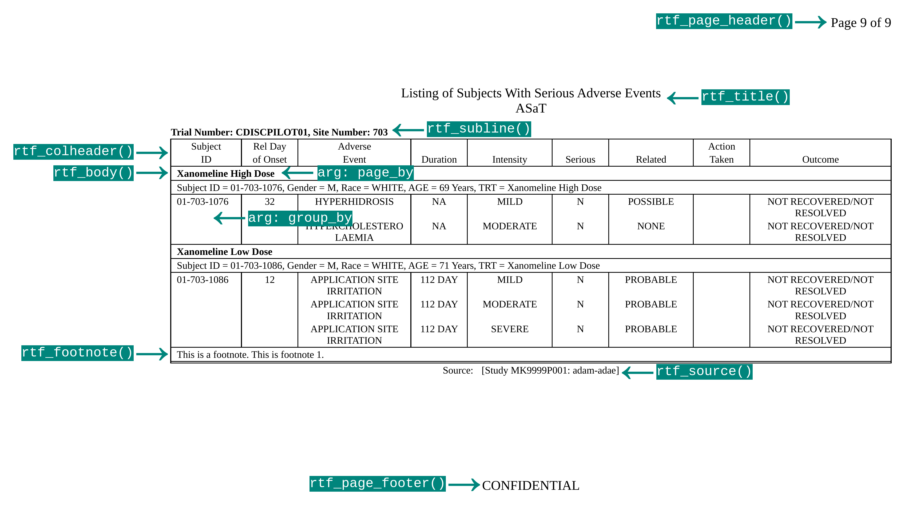

# Welcome {background-color="#385898"}

## Disclaimer

The views and opinions expressed in this presentation are those of the
individual presenters and do not represent those of their affiliated
organizations or institutions.

## Acknowledgements

- R/Pharma organizers
  - It is a fun and productive annual gathering
  - Please consider sharing stories and use cases to expand the community

- Team members from Meta Platforms and Merck & Co., Inc., Rahway, NJ, USA

- Contributors of pycsr and r4csr training materials
  - Please consider submitting issues or PR in the repos

# rtflite intro {background-color="#385898"}

## Key components

rtflite provides Python classes `RTFDocument` that map to table elements.
The goal is to help you translate data frame to tables in RTF file.

{width=300}

## Example

```python
import polars as pl
import rtflite as rtf

# Load and prepare data
df = pl.read_parquet("data/adsl.parquet")

# Create RTF document
doc = rtf.RTFDocument(
    df=df.head(6),
    rtf_body=rtf.RTFBody(),
)

doc.write_rtf("output.rtf")
```

<embed src="https://pycsr.org/pdf/tlf_overview1.pdf" style="width:100%; height:400px" type="application/pdf">

# Analysis package {background-color="#385898"}

## What is an analysis package?

A **Python package** designed specifically to organize analysis scripts and code for a clinical trial project.

**Purpose:**

Our primary focus is creating a standard folder structure to organize the
project, with 3 goals in mind:

- Project folder structure for clinical trial deliverables
- Reproducible environments for analyses
- Submission-ready structures for regulatory review

**Combines:**

- Python package structure (code organization)
- Quarto project (report generation)
- Regulatory requirements (eCTD submission)

## Package structure

[Posit Cloud workspace](https://01a0de2f-b9c1-0eae-4f6e-354f156e5cce.share.connect.posit.cloud/#workshop-instructions)

::: {style="font-size: 150%;"}

```
demo-py-esub/
├── pyproject.toml          # Project metadata
├── .python-version         # Python version
├── uv.lock                 # Locked dependencies
├── src/demo001/            # Study-specific code
│   ├── __init__.py
│   └── utils.py
├── analysis/               # Quarto analysis docs
│   └── tlf-*.qmd
├── data/                   # ADaM datasets
├── output/                 # Generated TLFs
└── tests/                  # Validation tests
```

:::

See: <https://pycsr.org/pkg-structure.html>

::: {style="font-size: 100%;"}

## Benefits

:::: {.columns}
::: {.column width="50%"}

**Consistency**

- Standard structure across projects
- Team knows where files belong

**Reproducibility**

- `uv.lock` pins dependencies
- `.python-version` specifies Python

:::

::: {.column width="50%"}

**Automation**

- `uv sync` restores environment
- `quarto render` generates outputs
- `pytest` validates code

**Compliance**

- Built-in documentation
- Testing infrastructure
- Standard structure

:::
:::
:::

## Git-centric workflow

**Core principle:** All project assets in version control.

**Plain text workflow:**

- `.qmd` files for analysis (not `.ipynb` for final deliverables)
- `.md` files for documentation
- `.toml` files for configuration
- Avoid `.xlsx` files for tracking

**Project tracking:**

- Issues for requirements
- Pull requests for review
- Project boards (Kanban)

See: <https://pycsr.org/pkg-management.html>

## Development lifecycle

:::: {.columns}
::: {.column width="50%"}

**Planning:**

- Define TLFs from SAP
- Create mock tables
- Assign validation levels
- Lock Python version and package repo

**Development:**

- Create feature branches
- Implement in `analysis/` and `src/`
- Self-test against mocks
- Open pull requests
:::

::: {.column width="50%"}
**Validation:**

- Independent review
- Write unit tests in `tests/`
- Run automated checks (`ruff`, `mypy`, `pytest`)

**Delivery:**

- Generate all outputs with `quarto render`
- Prepare submission package
:::
:::

# eCTD submission {background-color="#385898"}

## FDA requirements

[FDA Study Data Technical Conformance Guide](https://www.fda.gov/media/88173/download) Section 4.1.2.10:

> Submit programs for **primary and secondary efficacy analyses**.
> Specify software in **ADRG**.
> Use **ASCII text format**.
> No executable extensions.

**Goal:** Enable reviewers to understand and confirm analysis algorithms.

See: <https://pycsr.org/submission-overview.html>

## Demo repositories

**Analysis package:**
<https://github.com/elong0527/demo-py-esub>

**Submission package:**
<https://github.com/elong0527/demo-py-ectd>

Clone and explore to see complete examples.

## eCTD Module 5 structure

::: {style="font-size: 150%;"}

```
m5/datasets/<study-id>/analysis/adam/
├── datasets/
│   ├── *.xpt               # ADaM datasets
│   ├── define.xml
│   ├── adrg.pdf            # Instructions
│   └── analysis-results-metadata.pdf
└── programs/
    ├── py0pkgs.txt         # Packed Python package
    ├── tlf-01-*.txt        # Analysis programs
    └── tlf-02-*.txt
```

:::

**Key:** All files in `programs/` must be ASCII text.

## The solution: pkglite for Python

Packs Python projects into portable text files.

**Why needed:**

- Python packages have directory structure
- May contain binary files
- FDA requires ASCII text format

**pkglite capabilities:**

- Pack entire project into single `.txt` file
- Preserve file paths and metadata
- Unpack to restore original structure
- Support multiple packages in one file

Documentation: <https://pharmaverse.github.io/py-pkglite/>

## Packing workflow

**1. Create `.pkgliteignore`**

```bash
uvx pkglite use demo-py-esub/
```

**2. Pack the package**

```bash
uvx pkglite pack demo-py-esub/ \
  -o programs/py0pkgs.txt
```

**3. Convert Quarto to Python scripts**

- Render `.qmd` -> verify it works
- Convert `.qmd` -> `.ipynb` -> `.py`
- Clean and format with `ruff`
- Save as `.txt` (no `.py` extension)

See: <https://pycsr.org/submission-package.html>

## Packed file format

Human-readable Debian Control File (DCF) format:

::: {style="font-size: 150%;"}

```
# Generated by py-pkglite
# Use `pkglite unpack` to restore

Package: demo-py-esub
File: pyproject.toml
Format: text
Content:
  [project]
  name = "demo001"
  version = "0.1.0"
  ...
```

:::

Reviewers can read without special tools.

## Updating ADRG

Document the Python environment:

**Python environment:**

| Software | Version | Description |
|----------|---------|-------------|
| Python | 3.14.0 | Programming language |
| uv     | 0.9.9  | Package manager      |

**Packages:**

| Package | Version | Description |
|---------|---------|-------------|
| polars | 1.35.1 | Data manipulation |
| rtflite | 1.1.0 | RTF generation |
| demo001 | 0.1.0 | Study functions |

**Appendix:** Step-by-step reproduction instructions.

## Dry run testing

**Essential:** Simulate reviewer experience before submission.

**Workflow:**

1. Create clean directory
2. Copy submission materials
3. Unpack package: `uvx pkglite unpack programs/py0pkgs.txt -o .`
4. Install dependencies: `cd demo-py-esub && uv sync`
5. Run programs: `python ../programs/tlf-*.txt`
6. Verify outputs match originals

**Catches:** Missing dependencies, path errors, platform issues.

See: <https://pycsr.org/submission-dryrun.html>

# Q&A {background-color="#385898"}

## Resources


- **Workshop Page** [pos.it/pycsr-rpharma-2026](https://pos.it/pycsr-rpharma-2026)
- **Book:** [pycsr.org](https://pycsr.org/)

**Regulatory:**

- [FDA Study Data Technical Conformance Guide](https://www.fda.gov/media/88173/download)
- [eCTD specifications](https://www.fda.gov/drugs/electronic-regulatory-submission-and-review/electronic-common-technical-document-ectd)

**Technical:**

- [rtflite](https://pharmaverse.github.io/rtflite/)
- [pkglite for Python](https://pharmaverse.github.io/py-pkglite/)
- [uv documentation](https://docs.astral.sh/uv/)
